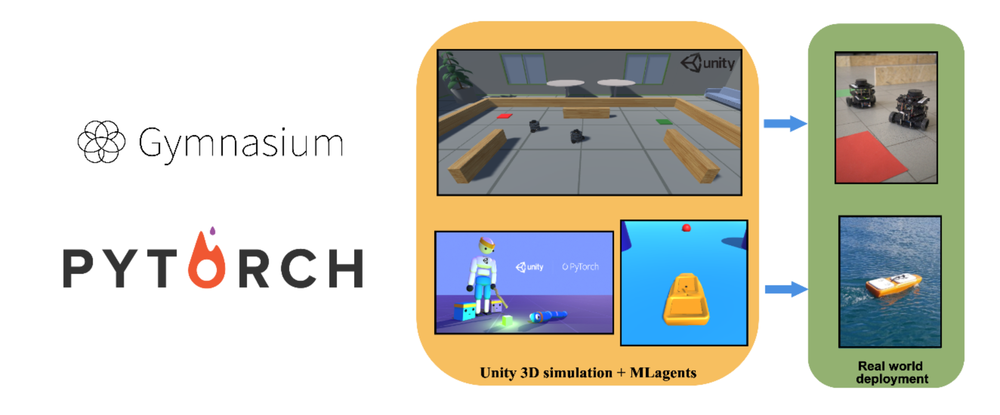
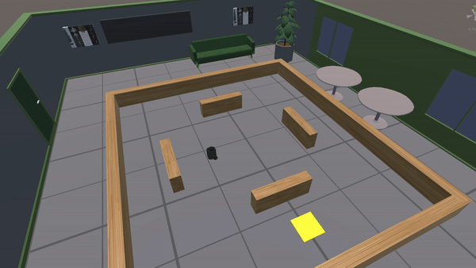
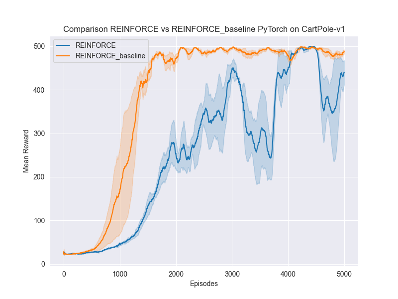

# ISLa-RL-Playground  

Welcome to the ISLa-Reinforcement Learning (RL) Playground!🚀 A Framework developed for the RL course at the University of Verona designed to help students familiarize and test their own PyTorch implementations of advanced state-of-the-art Deep Reinforcement Learning (DRL) methods for [Gymnasium](https://gymnasium.farama.org) and [Unity+ML agents](https://unity.com/products/machine-learning-agents)-based realistic environments.

<div style="text-align:center;">
    
</div>


<div style="display: flex; justify-content: space-between;">
    
    
    
    
</div>

## Features

- **Comprehensive explanation**: We provide here below extensive documentation to guide students through the framework, including setup instructions, examples, and explanations of key concepts.

- **Easy-to-Use Access**: The framework is designed to be user-friendly, allowing students to quickly experiment with various RL algorithms.

- **Integration with Wandb**: We offer seamless integration with [Weights & Biases (wandb)](https://wandb.ai/) for logging and visualizing experiment results. Students can easily track their training progress and compare different algorithms using the wandb dashboard.

- **Local Plotting**: In addition to wandb, students can also choose to automatically plot their results locally using popular Python libraries such as seaborn and matplotlib on their own PCs. This provides flexibility and ensures students can visualize their results without an internet connection.

## Getting Started

**Installation**: Clone the repository and follow the setup instructions provided here below:
   > To use this repo, we suggest creating a virtual environment using Anaconda and installing all the dependencies reported above. If you have followed the RL course, you simply have to activate your RL conda environment.

   ISLa-RL-playground is tested on Python 3.8+ and PyTorch 2.x. It can be installed easily into a conda environment. If you don't have anaconda, you can install it from here [miniconda](https://docs.conda.io/en/latest/miniconda.html).

```bash
cd ISLa-RL-Playground
# Remove the old environment, if necessary.
conda deactivate; conda env remove -n rl-playground
# Create a new conda environment
conda env create -f RL_playground-env.yml
# Activate the environment
conda activate rl-playground
```

*NB: if you want to install a specific version of PyTorch (e.g., GPU, Windows, or Mac), please refer to the official installation page ([here](https://pytorch.org)).*

## Configure your experiments

1. The first step in using the framework is to develop the DRL algorithms. In the folder `algos_template`, you can find a set of Python template files that you have to fill in. Note that you can decide to implement all the algorithms or only a part; however, remember that some algorithms might perform better than others depending on the characteristics of the environment (e.g., continuous or discrete observation/action space)!

> You can also test different environments from the Gymnasium suite. However, if you're using this framework as part of the RL exam, we will evaluate your implementation in the following 4 environments:
> 1. CartPole-V1
> 2. LunarLander 
> 3. FrozenLake
> 4. TB3 Unity env

> And we will consider/support only these algorithms for the evaluation:
> 1. PPO
> 2. DDPG
> 3. SAC
> 4. MCTS

> Several examples and templates are provided to understand how to define environments, implement algorithms, and train agents using the framework.

2. Once you have finished implementing your algorithms, you only have to modify the `config.yml` file, as shown in this simple example:

```yaml
use_wandb: True
wandb_config:
  project: "FrameworkRL"
  entity: "luca0" # set entity with this name for the final submission
  tag: "Student_VR111111"

DRL_methods:
  - name: REINFORCE
    parameters:
      hidden_layers: 2         # The number of hidden layers of the neural network
      nodes_hidden_layers: 32  # The number of neurons in hidden layers of the neural network
      gamma: 0.99              # Discount factor
      lr_optimizer_pi: 0.00004 # learning rate optimizer policy pi
      baseline: True           # if using baseline approach or not in the update function
      lr_optimizer_vf: 0.00004 # learning rate optimizer value function
     

    gym_environment: CartPole-v1
    tot_episodes: 1500
    seeds_to_test: [0,1,2]
```
In the first row, you can specify whether to use or not wandb to log your results. **If you are using this framework for the project exam, you must set True the `use_wandb` variable, set `entity` variable to "luca0" and define your ID in the `tag` parameter before the final submission**. In the `DRL_methods` section, specify each method implemented with the respective hyperparameters to use in each environment you want to test. In the example, we define the algorithm REINFORCE with baseline, using a discount factor gamma=0.99, a policy network composed of two hidden layers with 32 nodes with an optimizer for the policy adam and an initial learning rate=4e-5, and similar for the value function network. Finally, we specified that we want to test this algorithm with these specific hyperparameters on the `CartPole-v1` gym environment for 1500 episodes using the seed 0,1,2 for the DNN and environment initialization, respectively. 

> To test/compare multiple algorithms in the same environment, you should create another subsection with the same structure reported above. For example, if you want to test REINFORCE and PPO on `CartPole-v1` you will have:

```yaml
DRL_methods:
  - name: REINFORCE
    parameters:
      hidden_layers: 2         # The number of hidden layers of the neural network
      nodes_hidden_layers: 32  # The number of neurons in hidden layers of the neural network
      gamma: 0.99              # Discount factor
      lr_optimizer_pi: 0.00004 # learning rate optimizer policy pi
      baseline: True           # if using baseline approach or not in the update function
      lr_optimizer_vf: 0.00004 # learning rate optimizer value function
     

    gym_environment: CartPole-v1
    tot_episodes: 1500
    seeds_to_test: [0,1,2]

  - name: PPO
      parameters:
        hidden_layers: 2         # The number of hidden layers of the neural network
        nodes_hidden_layers: 32  # The number of neurons in hidden layers of the neural network
        gamma: 0.99              # Discount factor
        lr_optimizer_pi: 0.001   # learning rate optimizer policy pi
          
      gym_environment: CartPole-v1
      tot_episodes: 1500
      seeds_to_test: [0,1,2]
```

This config will read your REINFORCE and PPO implementation provided in the algos_template and run a comparison between the algorithms. Please note that for a fair comparison, the number of episodes and the seeds used should be the same! If a list of at least 3 seeds to test is not specified, we randomly generated it for each method provided.

## Launch the experiments

Once modified the `config.yml` you just have to type:

```bash
cd ISLa-RL-Playground
python main.py
```

This command will launch all the experiments specified in the yaml file.
## Logging

To use wandb for experiment logging, sign up for an account on the wandb website and obtain your API key. Then, follow the instructions in the documentation to set up wandb integration and start logging your experiments.
If, instead, you prefer to plot your results locally, just specify in the yaml config file `use_wandb=False`, and the framework automatically will plot for you the comparison in the folder `results/env/`.

## Baseline

Here, we provide the plots of our baseline in the environments supported in the framework to have a general idea of the expected performance of your algorithms. Please note that these results are obtained with simplified implementations, and we encourage you to achieve better performance with respect to the one reported here! 

<div style="text-align:center;">
    
</div>

Happy Reinforcement Learning! 🤖

## Author and contact information
*  Teaching assistant: **Luca Marzari** - luca.marzari@univr.it
